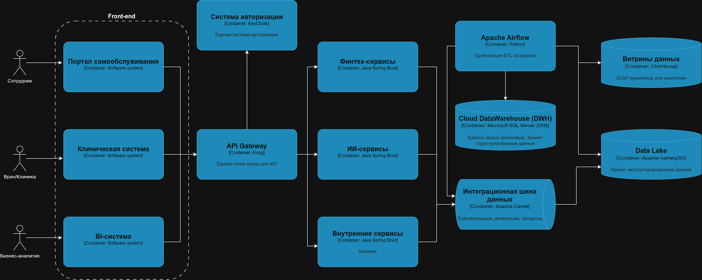

# Проектирование целевой архитектуры и приоритизация проблем для поддержки ключевых бизнес-сценариев компании

### 1. Целевая архитектура

### 2. Проблемные места и их описание

| № | Проблемное место | Связанные бизнес-сценарии | Описание проблемы | Влияние на бизнес |
|---|-------------------|---------------------------|---------------------|-------------------|
| 1 | Использование устаревшего технологического стека DWH на SQL Server 2008 | Все сценарии | Ограниченная масштабируемость, плохая производительность, высокие затраты на поддержку | Замедление аналитики, задержки в принятии решений |
| 2 | Централизованная бизнес-логика в DWH | Быстрая отчетность, масштабирование | Трудно развивать и менять бизнес-правила без больших затрат | Негибкость в реагировании на изменения рынка |
| 3 | Монолитная и устаревшая инфраструктура BI (Power BI + PowerBuilder) | Отчеты, аналитика | Медленная генерация отчетов, сложности при расширении | Замедление time-to-market, снижение качества аналитики |
| 4 | Интеграционный слой через старую шину данных | Внедрение новых источников | Ограниченная гибкость, сложности с подключением новых систем | Задержки в интеграции новых бизнес-направлений |
| 5 | Отсутствие Data Lake | Новые бизнес-аналитики и самообслуживание | Неэффективная обработка больших данных, сложности в подготовке данных | Задержки в формировании аналитических выводов |

### 3. Приоритизация проблем

| № | Проблема | Приоритет | Почему важно | Влияние на бизнес |
|---|------------|------------|----------------|-------------------|
| 1 | Устаревший DWH (SQL Server 2008) | MUST | Критично для масштабируемости и производительности | Замедление аналитики, риск потери данных |
| 2 | Централизованная бизнес-логика | SHOULD | Усложняет развитие новых сценариев, влияет на гибкость | Невозможность быстрого реагирования |
| 3 | Старые BI-инструменты (Power BI + PowerBuilder) | MUST | Влияет на скорость и качество отчетности | Потеря конкурентных преимуществ |
| 4 | Интеграционный слой | COULD | Можно модернизировать без критического риска | Ускорение внедрения новых систем |
| 5 | Отсутствие Data Lake | MUST | Необходимость обработки больших данных, аналитика | Критично для развития новых бизнес-направлений |