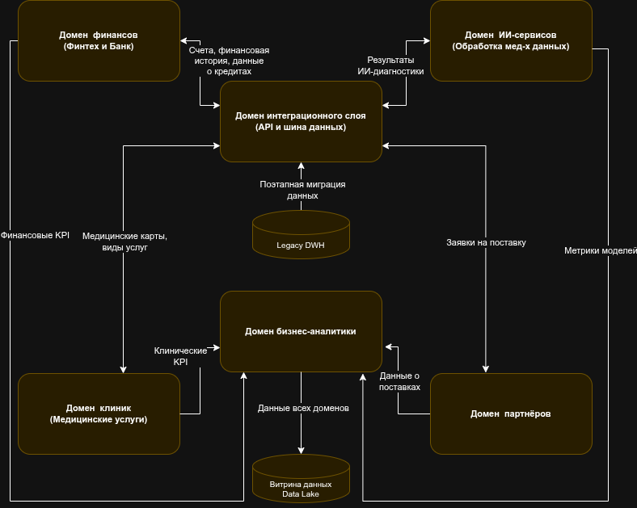

# Разделение системы на домены и моделирование потоков данных для поддержки ключевых бизнес-сценариев

## Обоснование разделения системы на домены

**Бизнес-цели:**  
- Обеспечить независимое развитие каждого бизнес-направления (клиники, финтех, ИИ, фармацевтика, электроника).  
- Минимизировать вмешательство в центральный DWH для новых сценариев.  
- Обеспечить быстрый вывод новых продуктов и сервисов.  
- Улучшить безопасность и контроль доступа (разграничение данных).  
- Повысить отказоустойчивость и упростить масштабирование.

**Преимущества для бизнеса:**  
- **Быстрое внедрение новых функций и сервисов:** новые домены можно развивать независимо, не ожидая полной миграции или изменений в остальных областях.  
- **Меньшая зависимость от легаси-систем:** отдельные домены могут работать на новых технологиях без необходимости менять весь DWH.  
- **Гибкость и масштабируемость:** отдельные команды могут работать над своими доменами, внедряя свои бизнес-правила.  
- **Улучшенная безопасность:** разграничение доступа и изоляция данных.

## Предлагаемое разделение на домены

### 1. **Домен Клиник (Медицинские услуги)**  
- **Функции:** управление карточками пациентов, история болезни, результаты диагностических исследований, расписания, назначения.  
- **Потребности:** доступ для медицинского персонала, аналитика по клиническим кейсам, интеграция с ИИ-сервисами для диагностики.  
- **Данные:** медицинские карты, исследования, назначения.

### 2. **Домен Финансов (Финтех и Банк)**  
- **Функции:** управление счетами, транзакциями, кредитами, платежами, аналитика финансовых потоков.  
- **Потребности:** обработка транзакций, отчёты, интеграция с внешними банками и финтех-сервисами.  
- **Данные:** платёжные операции, кредитные истории, финансовая аналитика.

### 3. **Домен ИИ-сервисов**  
- **Функции:** обработка медицинских данных, диагностика, рекомендации, обучение моделей.  
- **Потребности:** получение данных из клиник, подготовка данных, хранение результатов анализа.  
- **Данные:** медицинские изображения, результаты исследований, модели ИИ.

### 4. **Домен Бизнес-аналитики и витрина данных**  
- **Функции:** предоставление портала самообслуживания, отчетность, дашборды, конструирование собственных отчетов.  
- **Потребности:** интеграция с данными из всех остальных доменов, разграничение доступа по ролям.  
- **Данные:** агрегированные бизнес-показатели, метрики.

### 5. **Домен Интеграционного слоя (API и шина данных)**  
- **Функции:** обмен данными между доменами, интеграция с внешними системами, потоковая передача данных.  
- **Потребности:** обеспечение асинхронной и синхронной коммуникации, трансформация данных.

## Итоговые преимущества разделения на домены

- **Независимое развитие**: команды могут внедрять новые решения без влияния на другие направления.  
- **Меньшая нагрузка на DWH**: бизнес-логика перемещается в отдельные сервисы, что снижает сложность и время обновлений.  
- **Масштабируемость**: каждый домен масштабируется независимо, что ускоряет внедрение новых сценариев.  
- **Улучшенная безопасность**: разграничение доступа и данных по доменам.